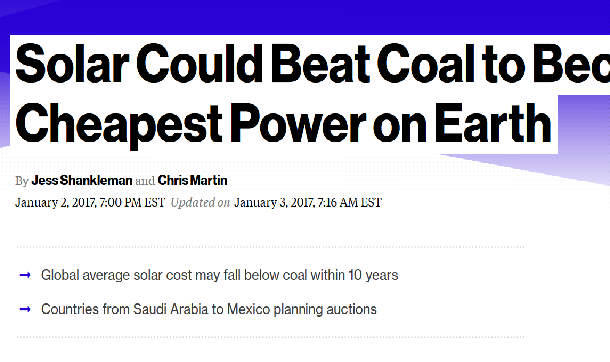
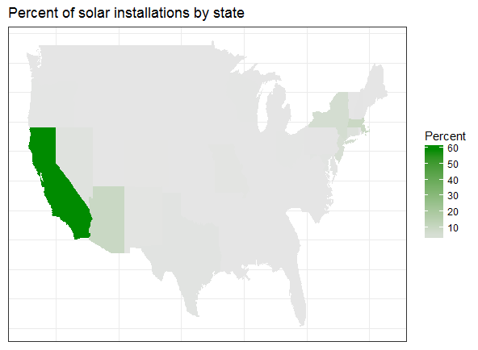
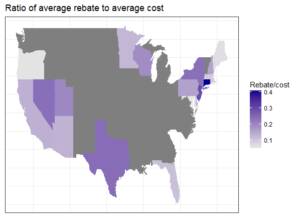
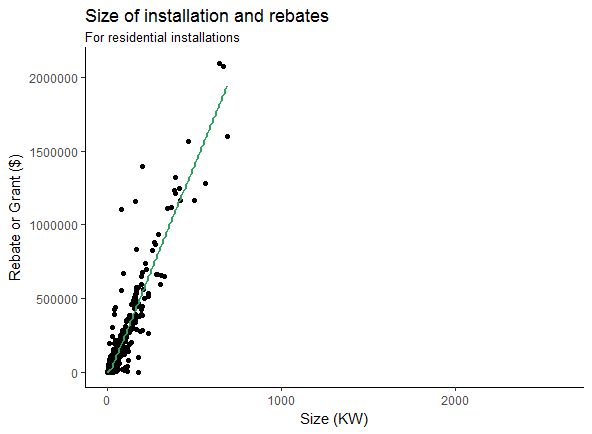
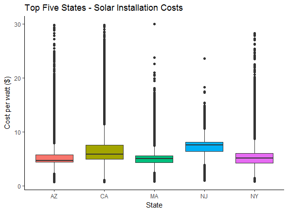

```{r setup, include=FALSE}
knitr::opts_chunk$set(echo = FALSE)
setwd("~/GitHub/Incubator-Proposal")
data <- read.csv("~/GitHub/Incubator-Proposal/solar.csv")
attach(data)
```

## Introduction




## Installations


## Cost ratio


## Size vs rebate



## Costs vary



## To Do
- Try clustering to determine typologies of solar installers based on incentives, rates, and income
- Zip code maps by state of income and installations
- Animated maps of installations over time 
